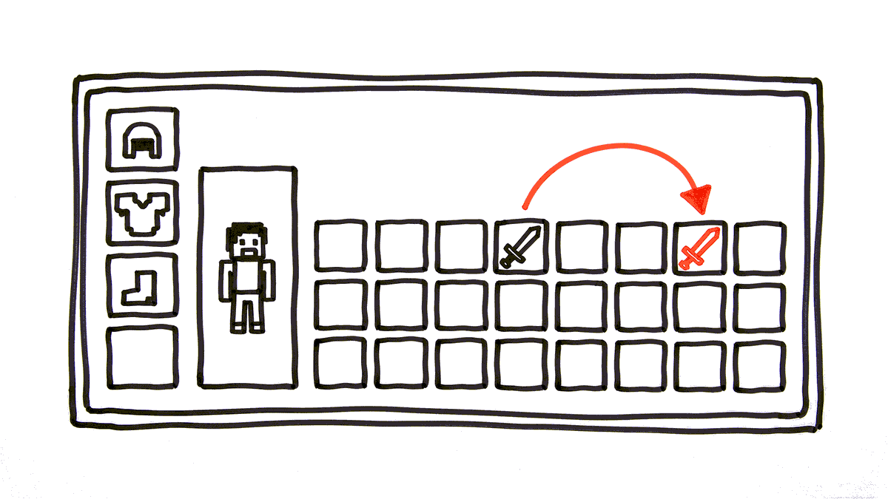

# **Тикет 1: «Экипировка»**

> **От кого:** *Марат*
>
> **Контекст:** *На тестовом сервере дюп. Игрок надевает меч, снимает — и мечей становится два. Эту систему писал Валера перед увольнением, и я догадываюсь, что он сделал. Перепиши экипировку с нуля, только в этот раз так, чтобы вещи не размножались.*

## Правила системы

Это и есть задание, других требований не будет.

- У игрока есть инвентарь (список вещей) и шесть слотов: голова, корпус, правая рука, левая рука, кольцо-1, кольцо-2.
- Надеть вещь — переместить её из инвентаря в слот. Если слот занят, прежняя вещь возвращается в инвентарь.
- Двуручное оружие занимает обе руки. Если в руках что-то было, обе вещи возвращаются в инвентарь.
- У вещи есть прочность. Прочность 0 — вещь сломана, но остаётся надетой и даёт 0 к характеристикам. **Пустой слот — это не вещь с нулевой прочностью.**
- Нельзя надеть вещь, если уровень игрока ниже требуемого.

## Что уже лежит в репозитории

`equipment.py` — классы `Item` и `Player`. Поля не трогай, на них завязан остальной сервер. Пишешь ты три функции:

| Функция | Возвращает |
|---|---|
| `equip(player, item)` | `True` — надели, `False` — не смогли |
| `unequip(player, slot)` | `True` — сняли, `False` — слот пуст |
| `total_power(player)` | сила надетых вещей; сломанная даёт 0 |

Слоты лежат в `player.slots` — словарь `имя слота → вещь или None`. Инвентарь — `player.inventory`, обычный список.

Двуручное оружие живёт в слоте `right_hand`. Пока оно там, `left_hand` остаётся `None`, и надеть в него ничего нельзя.

`valera_equip.py` — та самая старая версия. Она понадобится во втором пункте; чинить её не надо.

## Задача

Делается целиком, пунктами не торгуемся.

**1. Экипировка по правилам.** `equip` и `unequip`, вместе с двуручным оружием.

Главный инвариант — **сохранение вещей**: сколько вещей было у игрока (в инвентаре плюс в слотах) до операции, столько же и после. Ни одна ветка не имеет права ни создать вещь, ни потерять её. Проверь это `assert`-ом на каждой ветке: и там, где слот был занят, и там, где двуручное освободило обе руки, и там, где операция вообще не состоялась.

**2. Дюп Валеры.** В `valera_equip.py` он воспроизводится. Найди его, сведи к минимальному примеру в три строки, объясни причину в терминах объектов и имён и покажи, что твоя реализация на том же примере ведёт себя правильно.

**3. Сломанная вещь.** Почему проверка «слот пуст» через `if player.slots[slot]:` ломается на сломанной вещи? Покажи вход, на котором это видно, и почини.

**4. Некуда вернуть.** Игрок надевает двуручное оружие. В обеих руках вещи, инвентарь забит под завязку — вернуть их некуда.

Три варианта: отказать в действии · выбросить лишнее на землю · надеть частично. Выбери один, реализуй, защити. И назови, кто и как сможет злоупотребить именно твоим вариантом. Вместимость инвентаря лежит в `player.capacity`; в остальных пунктах считай, что место есть всегда.

## Как сдавать

Пушим в `main`:

- `equipment.py` — решение;
- `test_equipment.py` — твои тесты, в них должен быть инвариант сохранения вещей.

На каждый push прогоняются автопроверки, результат виден во вкладке **Actions** и в релизе `submit/...`. Они закрывают половину баллов за лабу — 3 из 6. Вторая половина — защита на паре.

Автопроверки видят только код. Разбор дюпа, ответ про сломанную вещь и выбранный вариант из четвёртого пункта они не проверяют — это разговор на защите.

## Вопросы на защите

- Покажи строку, которая гарантирует сохранение вещей.
- Что показал `id()`, когда ты искал дюп у Валеры.
- Чем сломанная вещь отличается от пустого слота в твоём коде.
